# Aviation Safety Reporting Application

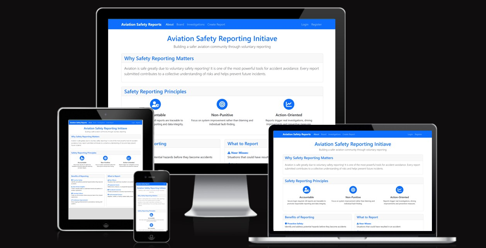

Aviation Safety Reporting is a Django-based web application designed to improve aviation safety through voluntary, non-punitive incident reporting. Aviation professionals can submit safety reports, track investigation statuses, and collaborate through comments, fostering a culture of continuous safety improvement.

The system provides role-based access control, allowing regular users to submit and view reports, while investigators can manage investigation statuses and track safety trends through comprehensive dashboards.

**Live Site:** [Aviation Safety Reporting Application](https://aviation-safety-reporting-82b23530b80a.herokuapp.com/)

**Repository:** [GitHub Repository](https://github.com/GuilhermeAviacao/CI_Proj04_SafetyReporting)

---
## Features

The Aviation Safety Reporting System provides a comprehensive platform for safety incident reporting and investigation management. Below are the main features of the application:

### Home / About Page
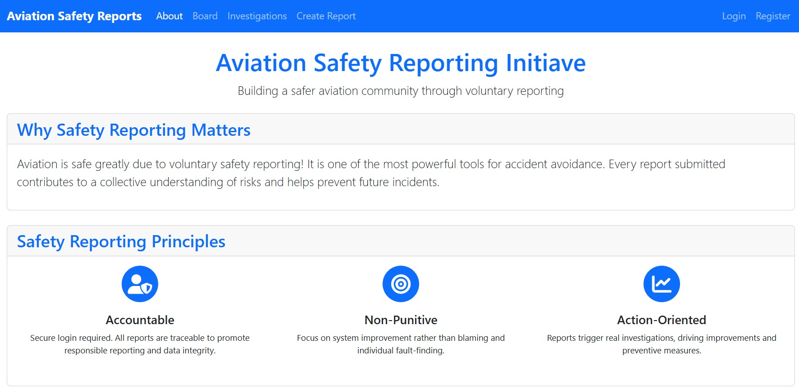
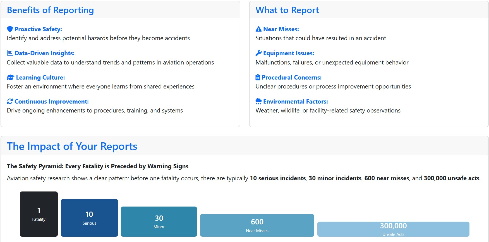
The landing page introduces users to the Aviation Safety Reporting System and its mission.

**Key Features:**
- **Non-Punitive Philosophy**: Clearly communicates the voluntary, confidential nature of safety reporting
- **Aviation Safety Context**: Explains the importance of incident reporting in improving aviation safety
- **Call-to-Action**: Prominent links to register, login, or view safety reports
- **Professional Design**: Clean, aviation-themed layout with responsive navigation
- **User-Friendly Navigation**: Easy access to all key sections (Board, Investigations, Create Report)

### Board Page (Latest Safety Reports)
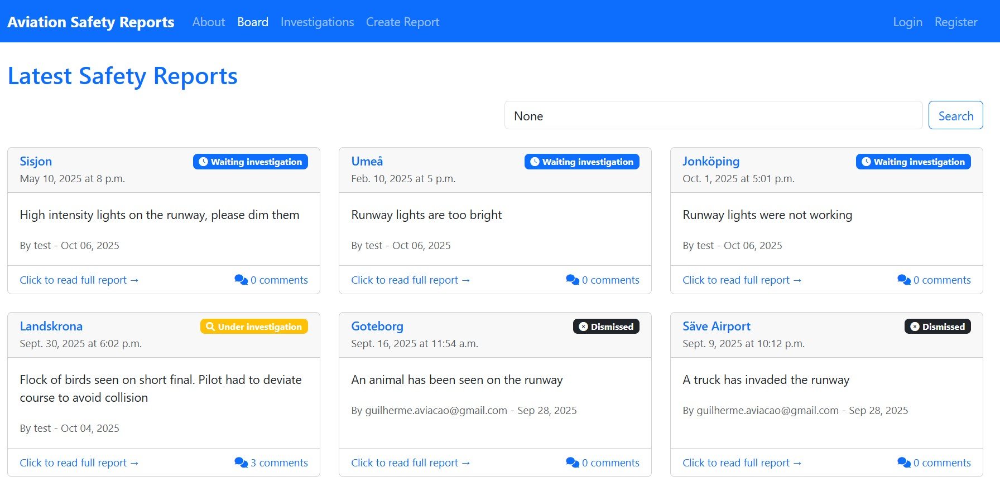
The central hub displaying all submitted safety reports in an organized, searchable format.

**Key Features:**
- **Card-Based Layout**: Each report displayed in a visually distinct card with key information
- **Color-Coded Status Badges**:
  - 🔵 Blue: Waiting investigation
  - 🟡 Yellow: Under investigation
  - ⚫ Grey: Investigation closed
  - ⚫ Dark: Dismissed
- **Search Functionality**: Real-time search to filter reports by location, description, or status
- **Pagination**: Displays 6 reports per page for optimal viewing experience
- **Quick Information**: Each card shows:
  - Report location (airport/airspace)
  - Incident date and time
  - Report author
  - Investigation status
  - Creation timestamp
- **Responsive Grid**: 3-column layout on desktop, automatically stacks on mobile devices
- **Click-Through Access**: Click any card to view full report details

### Report Detail Page
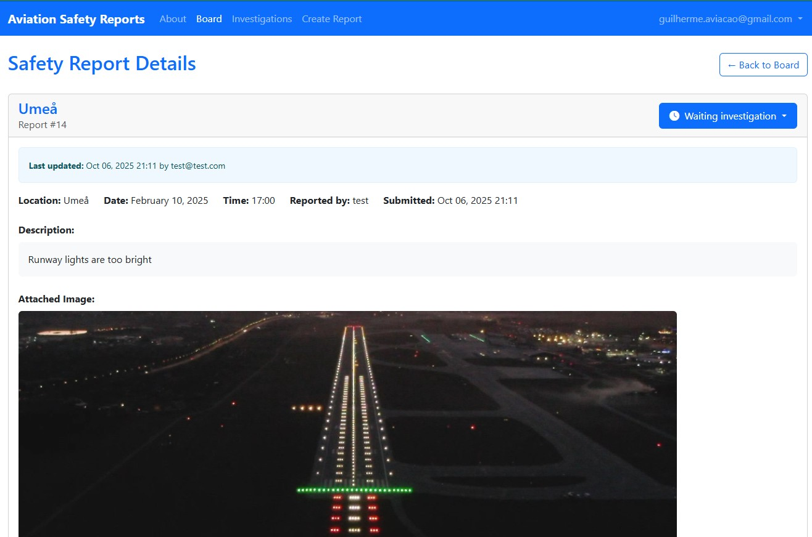
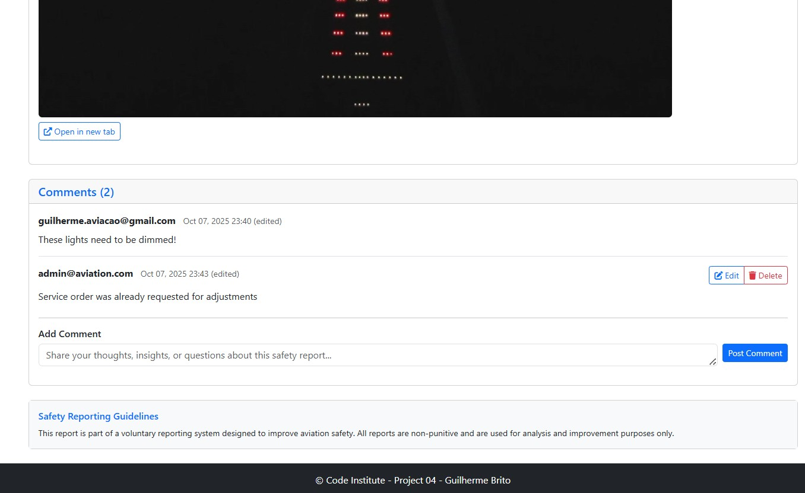
Comprehensive view of individual safety reports with collaboration features.

**Key Features:**
- **Complete Report Information**:
  - Full incident description
  - Location, date, and time details
  - Report author information
  - Creation and last update timestamps
- **Investigation Status Management** (Role-Based):
  - Regular users see status as a badge (read-only)
  - Investigators can update status via dropdown menu
  - AJAX-powered updates without page reload
- **Collaborative Comments Section**:
  - Real-time discussion thread for each report
  - Comment authorship tracking with timestamps
  - Edit/Delete controls (only for comment authors)
  - Inline comment form for seamless interaction
- **Ownership Controls**:
  - Authors can edit/delete their own comments
  - Visual indicators for user's own comments
- **Update Notifications**: Alert banner shows when report status was last modified
- **Responsive Layout**: Optimized for desktop, tablet, and mobile viewing

### Create Report Page
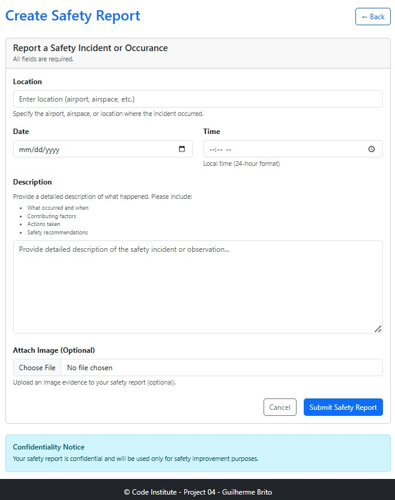
Secure, user-friendly form for submitting new safety incidents.

**Key Features:**
- **Authentication Required**: Only logged-in users can submit reports
- **Structured Form Fields**:
  - **Place**: Location of incident (airport code, airspace, etc.)
  - **Date**: Calendar picker for incident date
  - **Time**: Time picker for precise incident timing
  - **Description**: Large text area for detailed incident narrative
  - **Image Upload** (Optional): Attach supporting visual evidence
- **Form Validation**:
  - Required field indicators (*)
  - Real-time client-side validation
  - Server-side validation for data integrity
  - Clear error messages for invalid inputs
- **Helper Text**: Guidance prompts to help users provide complete information
- **Confidentiality Notice**: Reassurance about non-punitive nature and data privacy
- **Cancel/Submit Controls**: Clear action buttons with confirmation
- **Automatic Attribution**: Report automatically linked to authenticated user
- **Success Redirect**: Upon submission, redirects to the new report detail page

### Investigation Dashboard Page
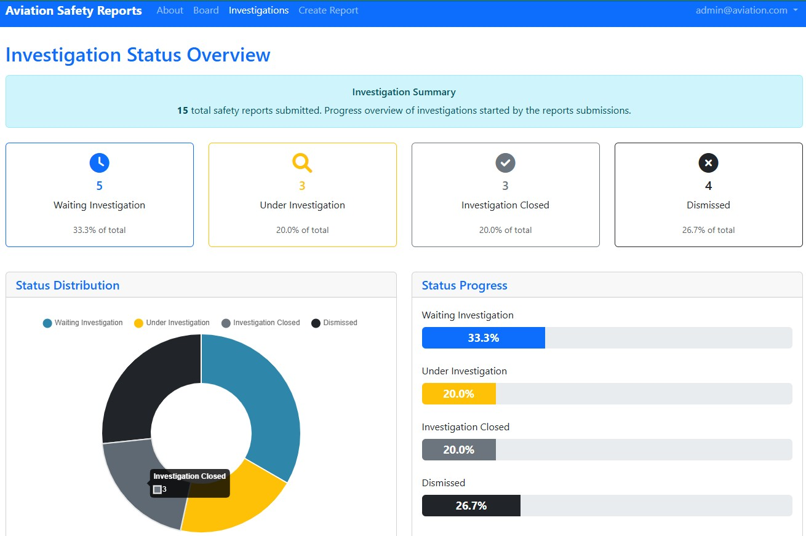
- Visual statistics with Chart.js doughnut chart
- Status distribution breakdown
- Total report count and percentages
- Quick overview of investigation workload

### Additional Features

**Role-Based Access Control:**
- **Regular Users**: Submit reports, view all reports, comment, manage own comments
- **Investigators**: All regular user permissions + update investigation status + access dashboard
- **Administrators**: Full system access including user management

**User Authentication:**
- Secure registration and login via Django Allauth
- Password reset functionality
- Session management
- Profile management

---

## Wireframes

The wireframes were created using Balsamiq to plan the structure and user flow before development.

### Key Pages:

#### 1. Board Page (Report Listings)

- Card-based layout for easy scanning of safety reports
- Color-coded status badges for quick visual identification
- Search functionality for filtering reports
- Responsive grid layout (3 columns on desktop, stacks on mobile)

#### 2. Report Detail Page

- Clear hierarchy: Report details → Comments → Action area
- Status management (dropdown for investigators, badge for users)
- Inline comment form for seamless collaboration
- Edit/Delete controls restricted to comment authors

#### 3. Investigations Dashboard

- Summary banner showing total report count
- Status cards with counts and percentages
- Visual distribution via Chart.js doughnut chart
- Color-coded progress indicators

#### 4. Create Report Form

- Structured form with clear field labels
- Helper text to guide users
- Confidentiality notice to encourage reporting
- Bootstrap validation styling

---

## Database Design

The database schema was designed to support role-based access control, investigation tracking, and collaborative commenting. The system uses Django's built-in User model extended with a custom UserProfile for role management.

### Entity Relationship Diagram

#### Overview of Relationships
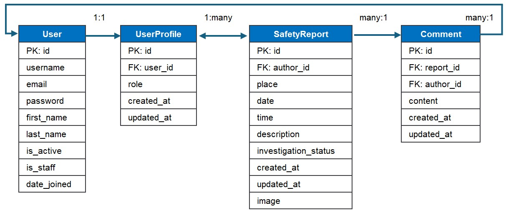

The database consists of four main entities:

#### 1. User Authentication
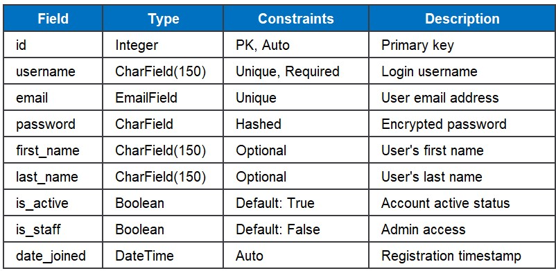

- Django's built-in User model handles authentication
- Stores username, email, password (hashed), and account status

#### 2. User Roles & Profiles
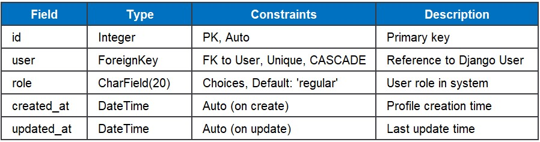

- One-to-One relationship with User model
- Role choices: Regular User, Investigator, Administrator
- Auto-created via Django signals on user registration

#### 3. Safety Reports
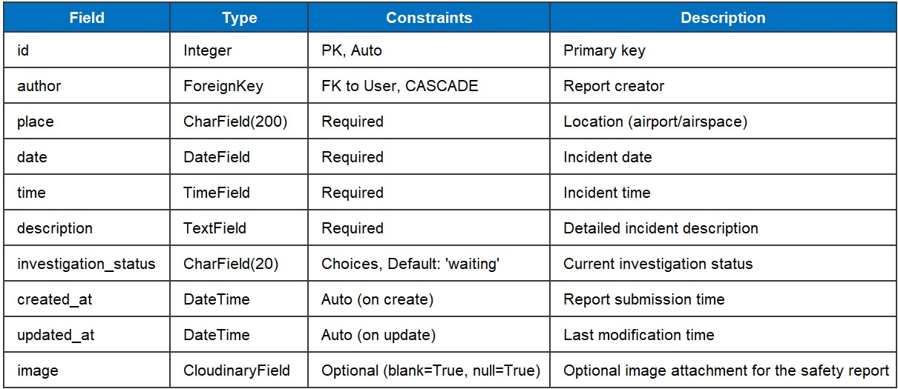

- Many-to-One relationship with User (author)
- Stores incident details: location, date, time, description
- Investigation status tracking: Waiting, Investigating, Closed, Dismissed
- Timestamps for audit trails (created_at, updated_at)

#### 4. Comments
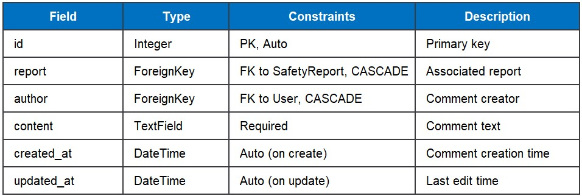

- Many-to-One relationship with SafetyReport
- Many-to-One relationship with User (author)
- Enables collaborative discussion on reports
- Edit/delete permissions restricted to comment authors

---

## Agile Development Process
- GitHub Projects & Issues

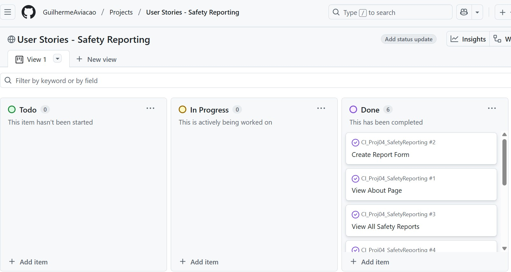

---

## Testing

Full documentation on [TESTING.md](TESTING.md)

---

## Credits

Code and troubleshooting assistance with Anthropic Claude (Sonnet 4.1 and 4.5 models).
Especially for the AJAX real-time drop-down page update solution. https://claude.ai/

Read-me inspired by former Code Institute student - Adam Shaw. 
https://github.com/adamshaw90/Trip-easy?tab=readme-ov-file