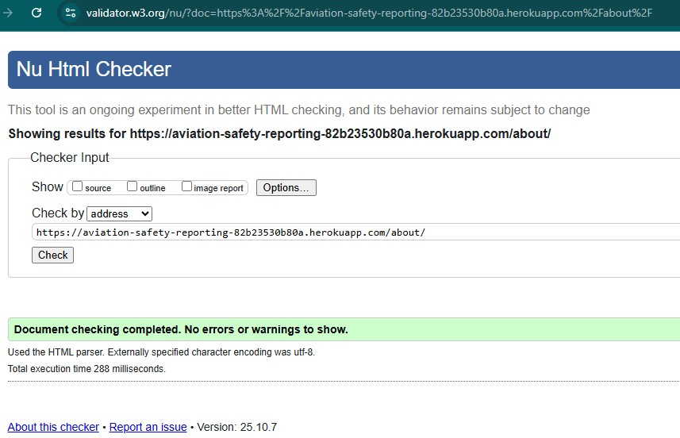
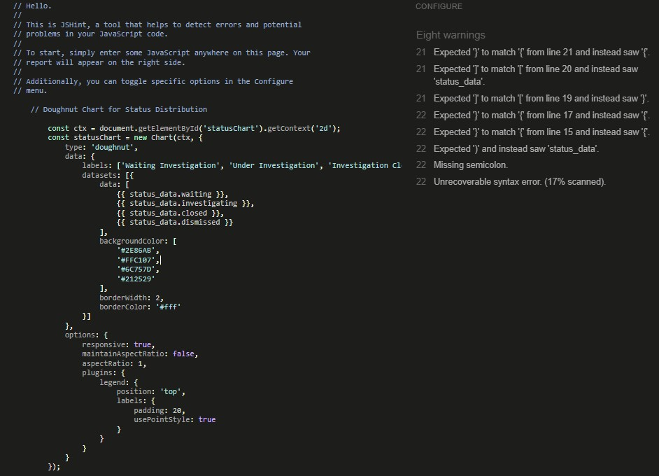
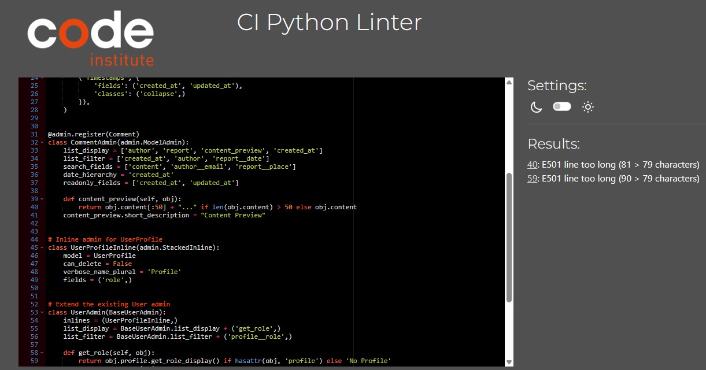

# Testing Results

## Performance Tests

Tested with Google Lighthouse

Performance and Best Practices scores were not calculated, due to an error from Lighthouse on logging (error no_navstart)
Accessibility: 94 / 100
SEO: 90 / 100

## Code Validation

Passed code thru validators with successful (or minor comments by the checkers)
### HTML 



### JavaScript


### Python Code Institute Linter


## Automated Tests

This project includes comprehensive automated tests for the reports app covering models, forms, and views.

### Test Files

- **test_models.py**: 32 tests for UserProfile, SafetyReport, and Comment models
- **test_forms.py**: 21 tests for SafetyReportForm and CommentForm
- **test_views.py**: 21 tests for all views including authentication and permissions

### Database Configuration for Tests

The project is configured to use SQLite for testing (see settings.py):

```python
# Use SQLite for testing
if 'test' in sys.argv:
    DATABASES['default']['ENGINE'] = 'django.db.backends.sqlite3'
```

This ensures fast test execution without affecting your production PostgreSQL database.

### What the Tests Cover

1. **Model Functionality**
   - Automatic UserProfile creation with user signals
   - Role-based permissions (regular, investigator, admin)
   - SafetyReport status colors and icons
   - Proper ordering and relationships

2. **Form Validation**
   - Required field validation
   - Optional field handling (image)
   - Custom form initialization

3. **View Behavior**
   - Authentication requirements
   - Permission checks (investigators only for status updates)
   - Comment ownership validation
   - Pagination functionality
   - Search functionality

### Test Evidence

#### Models (test_models.py)


- **UserProfileModelTest**: Tests user profile creation, roles, and permissions
- **SafetyReportModelTest**: Tests report creation, status methods, and ordering
- **CommentModelTest**: Tests comment creation and relationships

#### Forms (test_forms.py)


- **SafetyReportFormTest**: Tests form validation, required fields, and widgets
- **CommentFormTest**: Tests comment form validation and configuration

#### Views (test_views.py)


- **AboutViewTest**: Tests about page rendering
- **BoardViewTest**: Tests board view, pagination, and search
- **ReportDetailViewTest**: Tests report detail view and commenting
- **CreateReportViewTest**: Tests report creation and authentication
- **InvestigationsViewTest**: Tests investigation statistics page
- **UpdateInvestigationStatusViewTest**: Tests status updates and permissions
- **EditCommentViewTest**: Tests comment editing and ownership
- **DeleteCommentViewTest**: Tests comment deletion and ownership

### Test Results

All 74 tests passing 


